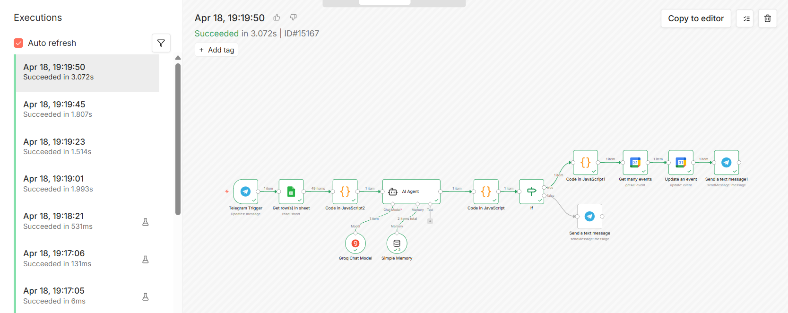

# Chatbot de reservas para gimnasio con IA

Un asistente conversacional por Telegram que responde preguntas sobre el gimnasio y gestiona reservas de clases — actualizando automáticamente el calendario del negocio sin intervención humana.

---

## Por qué lo construí así

La primera versión guardaba las reservas en el Google Calendar del cliente. Técnicamente funcionaba. Para el negocio, era inútil.

El cambio fue de perspectiva: diseñar la automatización para quien la paga, no para quien la usa. Ahora el gimnasio tiene un calendario propio donde se acumulan los nombres de los inscritos por clase. El dueño lo abre y sabe quién viene a cada sesión. Sin apps nuevas, sin formación, sin fricción.

---

## Qué hace

**Atención al cliente 24/7**
Responde preguntas sobre horarios, tarifas, clases disponibles, instalaciones y cualquier información del gimnasio. El propietario actualiza la información editando un Google Sheets — sin tocar n8n ni saber programar.

**Gestión de reservas por conversación**
El usuario le dice al bot qué clase quiere reservar. El agente recoge los datos necesarios de forma natural — clase, día, hora y nombre — confirma el resumen y registra la reserva automáticamente.

**Actualización del calendario del gimnasio**
Cuando se confirma una reserva, el bot busca el evento correspondiente en Google Calendar y añade el nombre del cliente en la descripción. El dueño ve en tiempo real quién ha reservado cada clase.

---

## Cómo funciona por dentro

El flujo se ejecuta cada vez que alguien manda un mensaje al bot:

1. **Telegram Trigger** — recibe el mensaje del usuario
2. **Google Sheets** — lee toda la información actualizada del gimnasio
3. **Code** — formatea las filas del Sheets en un bloque de texto limpio para el agente
4. **AI Agent** — recibe el mensaje del usuario y la info del gimnasio, decide si responder una pregunta o gestionar una reserva
5. **Code** — limpia el output del agente para que Telegram lo muestre correctamente
6. **IF** — detecta si el agente ha confirmado una reserva (presencia de JSON estructurado) o es una respuesta conversacional normal
7. **Rama TRUE** — parsea el JSON, calcula la fecha exacta, busca el evento en Google Calendar, añade el nombre del cliente y envía confirmación por Telegram
8. **Rama FALSE** — envía la respuesta conversacional directamente al usuario por Telegram

La memoria conversacional permite al agente mantener el contexto entre mensajes — si el usuario responde "sí" a una pregunta anterior, el agente lo interpreta correctamente sin perder el hilo.

---

## Stack

- **n8n** — self-hosted en VPS (Hostinger), orquesta todo el flujo
- **Groq API** — inferencia del LLM (tier gratuito)
- **LLaMA 3.3 70B** — modelo de lenguaje para el agente conversacional
- **Google Sheets** — base de conocimiento dinámica del gimnasio
- **Google Calendar** — registro de reservas por clase
- **Telegram Bot API** — canal de comunicación con el usuario

---

## Decisiones técnicas destacadas

**System prompt iterativo**
El prompt del agente pasó por muchas versiones. El reto principal fue conseguir que el agente supiera cuándo estaba gestionando una reserva y cuándo respondiendo una pregunta, sin confundir los dos modos. La solución fue separar explícitamente las dos funciones con instrucciones negativas claras.

**Formato de salida controlado**
Cuando el agente confirma una reserva, devuelve un JSON estructurado. Un nodo IF detecta su presencia y bifurca el flujo hacia la lógica de Calendar. Sin ese control, el JSON llegaba al usuario como texto plano.

**Cálculo dinámico de fechas**
El usuario dice "quiero reservar el martes". El sistema convierte ese día de la semana en una fecha ISO completa para poder buscar el evento correcto en Google Calendar.

**Base de conocimiento sin código**
El propietario del gimnasio puede añadir un aviso de cierre, cambiar una tarifa o actualizar un horario editando una celda en Google Sheets. El bot lo refleja en la siguiente conversación sin tocar n8n.

---

## Limitaciones conocidas

- La memoria conversacional es volátil — si n8n se reinicia, el contexto de las conversaciones activas se pierde
- El cálculo de fechas asume la próxima ocurrencia del día de la semana — no gestiona festivos ni cierres extraordinarios salvo que estén en el Sheets
- Sin autenticación de usuarios — cualquier persona con el enlace del bot puede hacer reservas

---

## Configuración

### Requisitos

- Instancia de n8n (self-hosted o cloud)
- [Groq API key](https://console.groq.com) — tier gratuito suficiente
- Bot de Telegram creado con [@BotFather](https://t.me/botfather)
- Google Sheets con la información del gimnasio
- Google Calendar con los eventos de clases ya creados de forma recurrente

### Estructura del Google Sheets

Dos columnas: `Concepto` e `Información`. Una fila por dato — nombre del gimnasio, horarios, tarifas, clases, etc. La fila `Aviso especial` permite comunicar cierres o cambios puntuales en tiempo real.
Puedes ver un ejemplo real de la base de conocimiento en [DB-Gimnasio-Ejemplo.pdf](DB-Gimnasio-Ejemplo.pdf).

### Google Calendar

Los eventos de cada clase deben estar creados manualmente como eventos recurrentes. El bot los busca por nombre y fecha, y añade los nombres de los inscritos en el campo descripción.

---

## Autor

**Jordi Garcia** — developer y consultor de automatización en Barcelona  
[LinkedIn](www.linkedin.com/in/jordi-garcia-míguez-208842309) · [GitHub](https://github.com/jordigarcia06)
